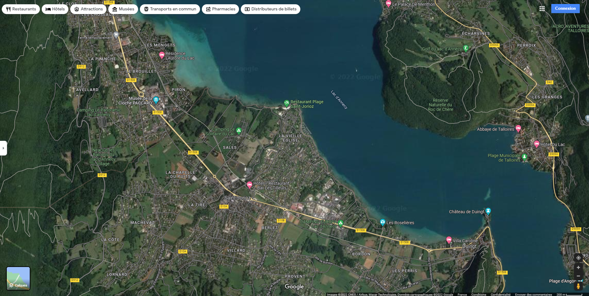
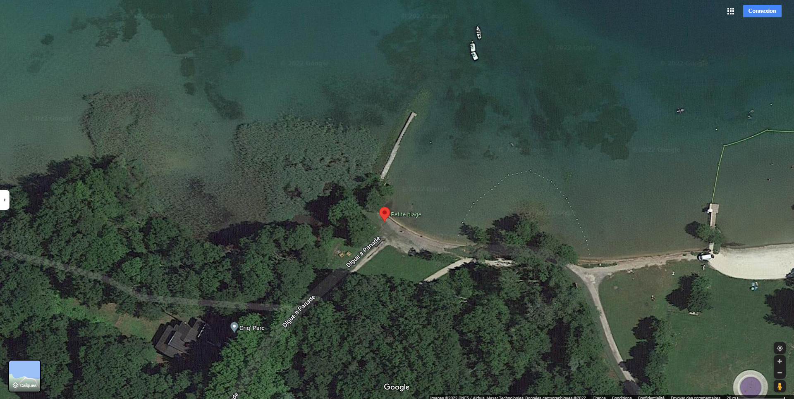
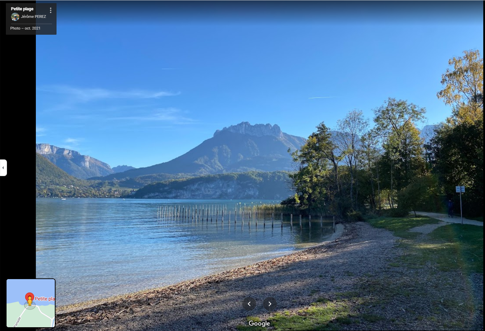

# PWNMECTF

## Consigne
Un riche arsitocrate souhaite acheter un énorme chateau pris pendant l'une de ces vacances, malheuresement son garde du corps ne se souvient plus de la localisation de ce bien. Il souhaiterait au moins trouver le nom de la ville pour pouvoir visiter ces alentours.

Flag : PWNME{city_name} ( en lowercase - les espaces deviennent des underscores "_" )

## Resolution
  
Sur cette photo on aperçoit un chemin, un lac puis une montagne.
En utilisant l'outil de google _Google Lens_ on tombe sur des annonces de locations à Saint-Jorioz.
À l'aide de _Google Map_, on cherche où se trouve le lac.

Ensuite on cherche où a été prise la photo.

La vue Satellite correspond parfaitement aux éléments de la photo. les photos prises par les utilisateurs confirment la position.

Enfin on relève le nom du chemin.

le flag est donc : **_404CTF{digue_à_panade}_**
