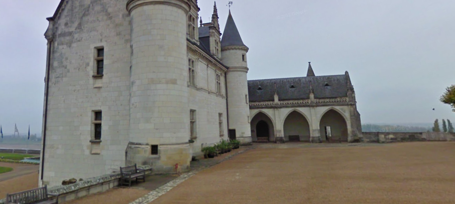

# PWNMECTF

## Consigne
Un riche arsitocrate souhaite acheter un énorme chateau pris pendant l'une de ces vacances, malheuresement son garde du corps ne se souvient plus de la localisation de ce bien. Il souhaiterait au moins trouver le nom de la ville pour pouvoir visiter ces alentours.

Flag : PWNME{city_name} ( en lowercase - les espaces deviennent des underscores "_" )

## Resolution
  
Sur cette photo on aperçoit un château.
En utilisant l'outil de google _Google Lens_ on tombe sur la page du Château Royal d'Amboise.

le flag est donc : **_404CTF{amboise}_**
