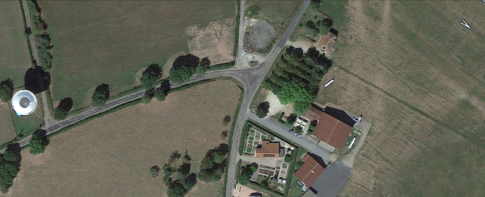
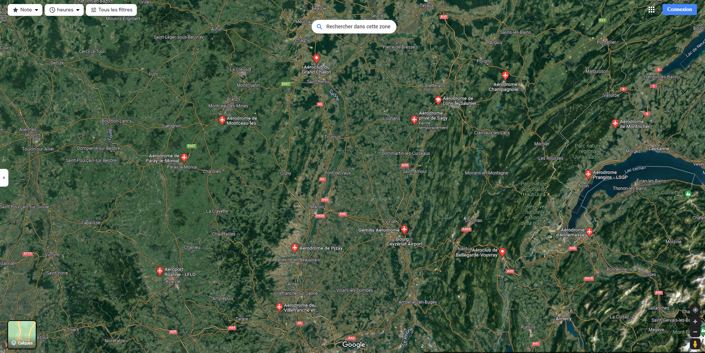
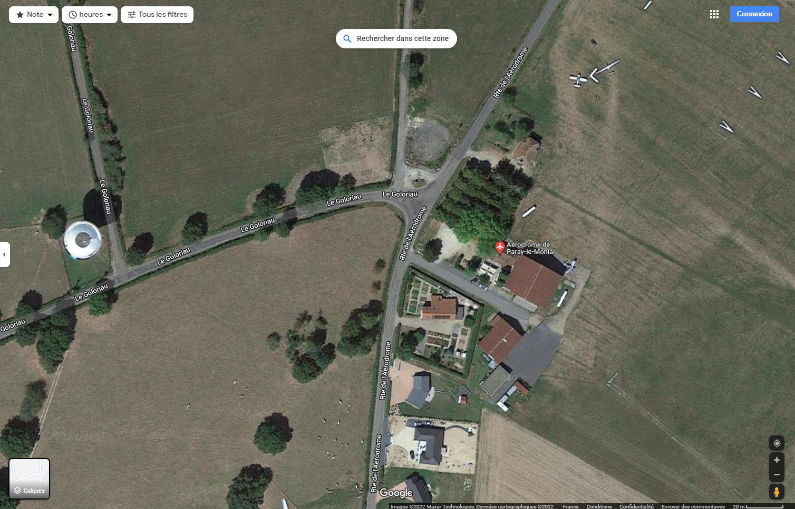

# PWNMECTF

## Consigne
Au moment du retour de ses vacances montagneuse, en direction de ce fameux chateau, le garde du corps a voulu prendre une photo aérienne et a eu la bonne idée de prendre un drone pour prendre une photo de très haut. Malheureusement ils ont perdu le drone mais ont réussi à retrouver l'image et aurait bien aimé savoir quel endroit ils ont pris en photo car le drone est devenu incontrôlable dû à sa hauteur.

Flag : PWNME{lieu} ( en lowercase - les espaces deviennent des underscores "_" )

## Resolution
  

Cette image est une capture de la vue satellite de google map.  
On y aperçoit le bout d'un aérodrome avec un avion.  
On sait que le trajet s'effectue entre Annecy et Amboise.  
On cherche donc dans cette zone la liste des aerodromes.  

    

L'aérodrome de Paray-le-Monial est celui que nous cherchons.

 

le flag est donc : **_PWNME{aérodrome_de_paray-le-monial}_**
